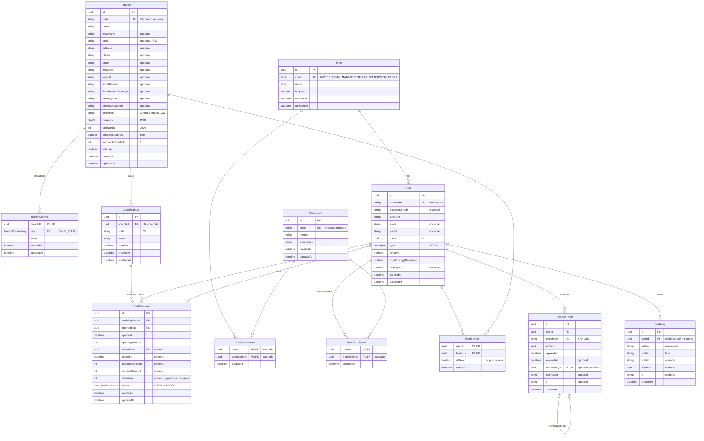
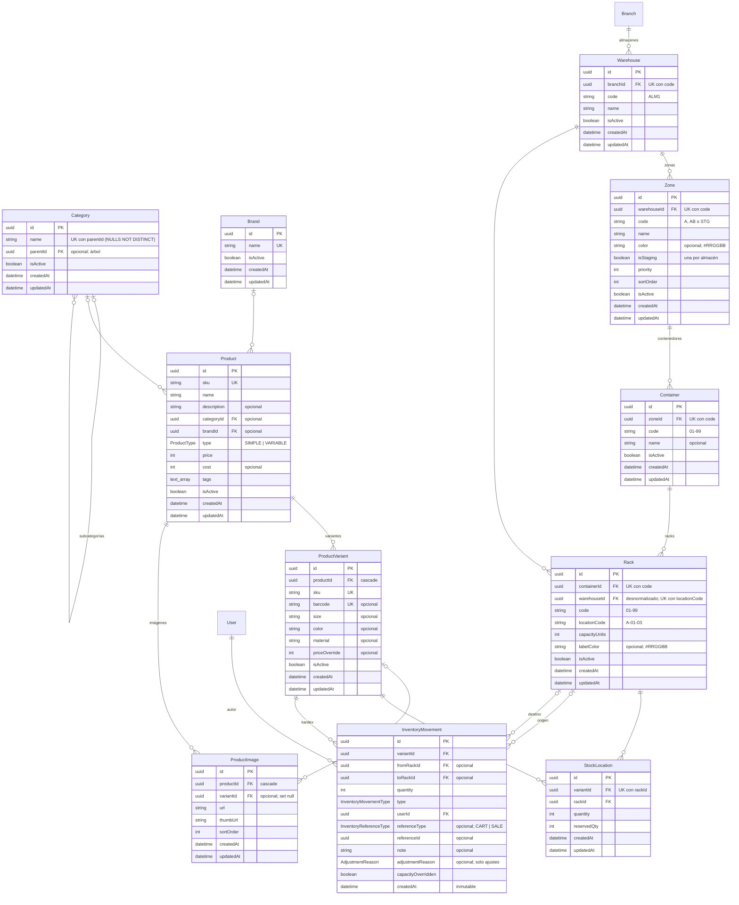
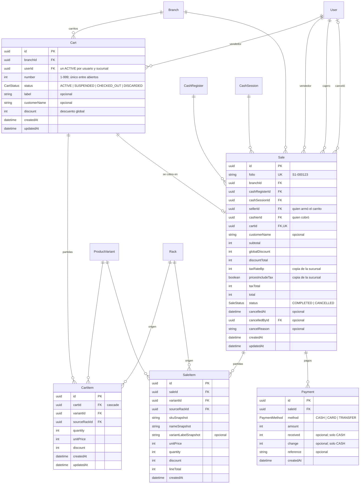

# ERD — warehouse-manager (MVP)

Diagramas del modelo de datos de `apps/api/prisma/schema.prisma` (spec F1 §4). Se mantienen **a mano**: cualquier cambio al schema se refleja aquí en el mismo commit.

Convenciones:
- Los nombres son los de Prisma (camelCase); en la BD las tablas y columnas van en snake_case (`User` → `app_user`).
- `PK` llave primaria, `FK` llave foránea, `UK` única. "opcional" = admite `NULL`.
- El dinero va en centavos (`int`). Las fechas son `timestamptz(3)`.
- Las restricciones `CHECK`, los índices parciales, el kardex inmutable y la vista `v_rack_occupancy` están en la migración `constraints` (spec F1 §5) y no se dibujan.

## 1. Organización y seguridad

## 2. Catálogo y almacén

## 3. Punto de venta

