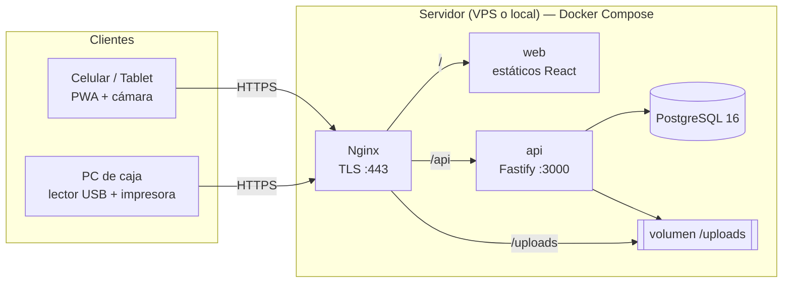
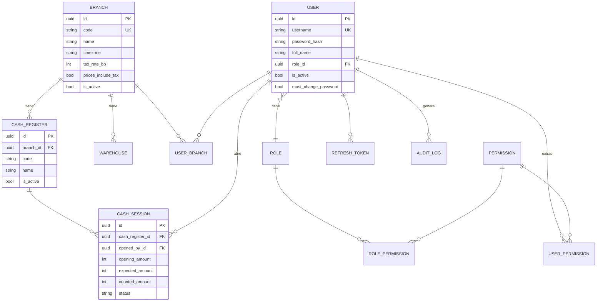
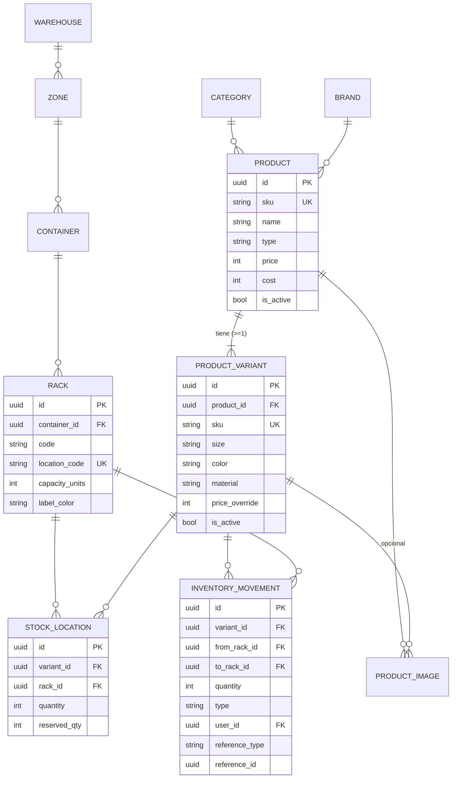
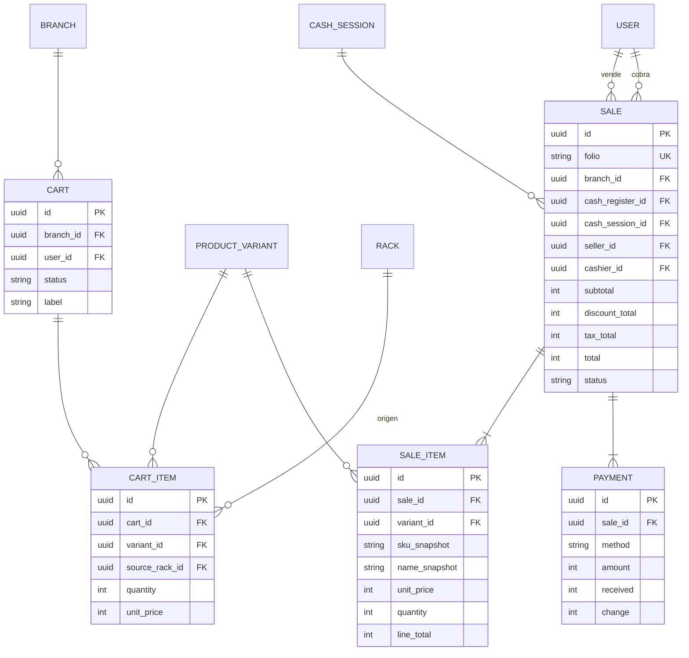
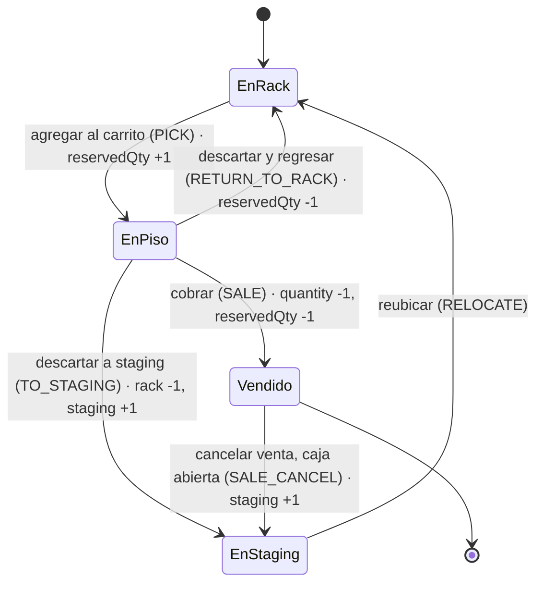
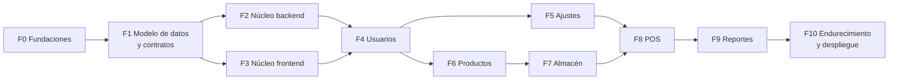
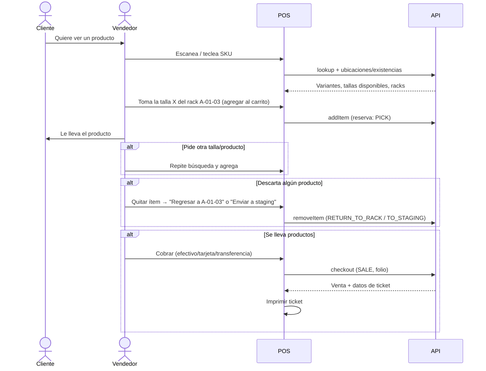

# Plan de implementación — MVP warehouse-manager

> Sistema web *mobile-first* de gestión de almacén/sucursales y punto de venta para una empresa de calzado, bolsos y accesorios.
> Este documento define **qué** se construirá y **en qué orden**. Las specs detalladas con TODOs por fase se generarán a partir de él (ver §14).

---

## Índice

1. [Resumen y alcance](#1-resumen-y-alcance)
2. [Arquitectura y stack](#2-arquitectura-y-stack)
3. [Convenciones de datos compartidos](#3-convenciones-de-datos-compartidos-bd--api--ui)
4. [Modelo de datos](#4-modelo-de-datos)
5. [Esquema de códigos de ubicación](#5-esquema-de-códigos-de-ubicación)
6. [Seguridad, autenticación y permisos](#6-seguridad-autenticación-y-permisos)
7. [Escaneo e impresión](#7-escaneo-e-impresión)
8. [Fases de implementación](#8-fases-de-implementación)
9. [Estrategia de pruebas](#9-estrategia-de-pruebas)
10. [Infraestructura y despliegue](#10-infraestructura-y-despliegue)
11. [Roadmap post-MVP y puntos de extensión](#11-roadmap-post-mvp-y-puntos-de-extensión)
12. [Riesgos y mitigaciones](#12-riesgos-y-mitigaciones)
13. [Preguntas abiertas para el cliente](#13-preguntas-abiertas-para-el-cliente)
14. [Siguiente paso: specs por fase](#14-siguiente-paso-specs-por-fase)

---

## 1. Resumen y alcance

### 1.1 Objetivo del producto
La empresa necesita operar desde el celular sus sucursales y almacenes. Las tareas principales son:
- ubicar productos en el almacén y saber dónde está cada uno;
- moverlos entre ubicaciones;
- vender desde el piso de venta.

A futuro se sumarán proveedores, portales de proveedores y clientes, transferencias entre sucursales y la sincronización de inventario con e-commerce (WooCommerce). El celular será el escáner principal, pero el sistema también debe funcionar con lectores de código de barras USB o Bluetooth.

### 1.2 Alcance del MVP

| Módulo | Entregables MVP |
|---|---|
| **Login** | Inicio de sesión con usuario y contraseña. Cierre de sesión. |
| **Usuarios** | Crear, editar y desactivar usuarios. Generar credenciales (usuario/contraseña). Asignar sucursales. Asignar permisos. |
| **Almacén / sucursal** | Mapa de productos con stock y estado. Ubicar productos. Ver la capacidad usada y disponible del almacén, sus contenedores y sus racks. Reasignar (reubicar) productos. Crear zonas, crear contenedores en una zona y crear racks en un contenedor. Generar QR de ubicaciones. Consultar existencias de un producto en otras sucursales (decisión 2026-10-03). |
| **Productos** | Carga masiva mediante una tabla editable tipo Excel/Shopify. Crear, actualizar y desactivar productos. Generar etiqueta con código de barras e imagen del producto. |
| **POS** | Abrir caja. Buscar producto. Agregar al carrito. Suspender carritos (hasta 5). Vender. Imprimir ticket. Cancelar una venta completa mientras su caja siga abierta (decisión 2026-10-01). Saber si un producto tiene existencias en otra sucursal (decisión 2026-10-03). |
| **Reportes** | Ventas por rango de fechas, por defecto el día actual, con totales. |
| **Ajustes** | Sucursales: 2 por defecto (S1 y S2, creadas por el seed), solo se editan sus datos. Cajas: 2 por sucursal, solo se editan sus datos (decisión 2026-10-03). |

### 1.3 Fuera del MVP (considerado en el diseño)
Estos módulos no se construyen ahora, pero el modelo de datos y la arquitectura dejan **puntos de extensión** para ellos (ver §11):
- Proveedores, órdenes de compra/resurtido y portal de proveedores.
- Portal de clientes y pedidos en línea.
- Transferencias de producto entre sucursales.
- Sincronización de inventario con WooCommerce.
- Sugerencia de ubicaciones según la rotación del producto (ABC).
- Operación multi-sucursal completa: crear sucursales y cajas.
- Impresión ESC/POS directa y modo offline.

---

## 2. Arquitectura y stack

### 2.1 Stack

| Capa | Tecnología | Notas |
|---|---|---|
| Lenguaje | TypeScript (estricto) | En todo el monorepo. |
| Frontend | React + Vite | SPA *mobile-first* e instalable como PWA (`vite-plugin-pwa`). |
| Ruteo / datos (web) | React Router, TanStack Query | Caché, reintentos e invalidación por módulo. |
| Formularios (web) | React Hook Form + `@hookform/resolvers/zod` | Usan **los mismos esquemas Zod** que el backend. |
| UI | Tailwind CSS + shadcn/ui (Radix) | Componentes accesibles con objetivos táctiles grandes. |
| Grid editable | `react-data-grid` o AG Grid Community (MIT) | Para la carga masiva. Se evita Handsontable por su licencia comercial. |
| Excel | `exceljs` | Generación y lectura de plantillas `.xlsx`. |
| Backend | Node.js 24 LTS + Fastify | Arquitectura modular por dominio. |
| Validación | Zod + `fastify-type-provider-zod` | Valida requests y responses y genera OpenAPI desde los mismos esquemas. |
| Documentación API | `@fastify/swagger` + `@fastify/swagger-ui` | Expuesta en `/api/docs` (protegida en producción). |
| ORM | Prisma | Migraciones versionadas y tipos generados desde el schema. |
| Base de datos | PostgreSQL 16 | |
| Autenticación | JWT (access) + refresh token en cookie httpOnly | Ver §6. |
| Hash de contraseñas | argon2id | |
| Imágenes | `@fastify/multipart` + `sharp` | Redimensionado y miniaturas guardados en un volumen. |
| Logs | pino (incluido en Fastify) | JSON estructurado. |
| Tests | Jest (+ React Testing Library en web) | Ver §9. |
| Infraestructura | Docker + Docker Compose | VPS o servidor local de la empresa. |
| Proxy | Nginx | TLS, estáticos, `/api` y `/uploads`. |
| Monorepo | pnpm workspaces | |

### 2.2 Estructura del monorepo

```
warehouse-manager/
├── apps/
│   ├── api/                 # Fastify
│   │   ├── prisma/          # schema.prisma, migrations/, seed.ts
│   │   └── src/
│   │       ├── core/        # config, plugins (auth, errores, prisma, swagger), utilidades
│   │       └── modules/     # auth, users, branches, registers, products, warehouse,
│   │                        # inventory, pos, reports  (routes + service + repo por módulo)
│   └── web/                 # React + Vite
│       └── src/
│           ├── app/         # router, providers, layout
│           ├── shared/      # componentes UI, ScanInput, impresión, hooks
│           └── features/    # auth, users, settings, products, warehouse, pos, reports
├── packages/
│   └── shared/              # esquemas Zod, enums, catálogo de permisos, tipos DTO,
│                            # utilidades: dinero, SKU, códigos de ubicación, fechas
├── infra/
│   ├── docker-compose.yml           # producción
│   ├── docker-compose.dev.yml       # desarrollo
│   ├── nginx/                       # configuración y certificados
│   └── scripts/                     # backup/restore
└── docs/
```

**Paquetes:** `@warehouse-manager/api`, `@warehouse-manager/web` y `@warehouse-manager/shared`.

**Regla de dependencias:** `web → shared` y `api → shared`. `shared` no depende de nadie y es TypeScript puro sin acceso a BD ni DOM.

### 2.3 Diagrama de despliegue



### 2.4 Arquitectura interna del backend
- **Módulo por dominio** con tres capas:
  - `routes`: definición HTTP, esquemas Zod y permisos requeridos.
  - `service`: reglas de negocio y transacciones.
  - `repository`: acceso a Prisma.
- Las operaciones que modifican stock pasan **siempre** por un único servicio de inventario (`InventoryService`). Ese servicio aplica las validaciones y escribe en el kardex. Ningún otro módulo actualiza `stock_location` directamente.
- Los plugins transversales son: `prisma`, `auth` (verificación del JWT), `permissions` (decorador `requirePermission`), `branchContext`, `errorHandler`, `swagger` y `rateLimit`.
- API versionada en `/api/v1`.

---

## 3. Convenciones de datos compartidos (BD ↔ API ↔ UI)

El objetivo es que un mismo dato tenga **una sola definición** y que BD, API y UI no puedan divergir.

| Tema | Convención |
|---|---|
| Identificadores | `UUID` en todas las tablas. Los folios legibles para humanos van aparte, por ejemplo `S1-000123` (sucursal + consecutivo), generado con un contador transaccional por sucursal. |
| Dinero | **Enteros en centavos** (`Int` en BD, `number` entero en API/UI). Nunca se usan flotantes. El formateo a moneda ocurre solo en la presentación (`formatMoney` en `shared`). |
| Cantidades | Enteros (unidades: par, pieza o caja). |
| Fechas | `timestamptz` en BD; ISO 8601 en UTC en la API. Cada sucursal tiene una `timezone` (por ejemplo `America/Mexico_City`) para calcular el "día actual" en reportes y cortes. |
| Nombres | BD en `snake_case` (mapeado con `@@map`/`@map` en Prisma). TS y JSON en `camelCase`. |
| Enums | Se definen en `shared` como `z.enum([...])` y se replican en Prisma. Un test verifica que ambos coincidan. |
| Contratos | Cada endpoint importa sus esquemas de `shared` (`XxxCreateInput`, `XxxUpdateInput`, `XxxDto`, `XxxListQuery`). Los tipos TS se obtienen con `z.infer`. |
| Paginación | Query `?page=1&pageSize=20&sort=field:asc&q=texto`. Respuesta `{ items, page, pageSize, total }`. |
| Errores | `{ code: string, message: string, details?: unknown }` con códigos estables, por ejemplo `AUTH_INVALID_CREDENTIALS`, `STOCK_INSUFFICIENT`, `RACK_CAPACITY_EXCEEDED`, `VALIDATION_ERROR`. La UI traduce por `code`. |
| Borrado | No hay borrado físico de entidades con historial. Se usa `is_active` (desactivar). |
| Auditoría | `created_at` y `updated_at` en todas las tablas. `created_by_id` donde aplique. |
| SKU | Mayúsculas, alfanumérico y `-`, de 3 a 40 caracteres. Se normaliza (trim + upper) en `shared`. |

---

## 4. Modelo de datos

### 4.1 Diagrama entidad-relación (MVP)

#### Organización y seguridad



#### Catálogo e inventario



#### Punto de venta



### 4.2 Detalle de entidades

#### Organización
| Entidad | Campos clave | Reglas |
|---|---|---|
| `Branch` (sucursal) | `code`, `name`, `legalName`, `taxId`, `address`, `phone`, `email`, `imageUrl`, `logoUrl`, `ticketHeader`, `ticketFooterMessage`, `promoQrText` (contenido del QR, que genera el sistema), `promoQrCaption` (descripción impresa bajo el QR), `timezone`, `currency`, `taxRateBp` (puntos base, 1600 = 16 %), `pricesIncludeTax`, `lowStockThreshold` (umbral de stock bajo, 2 por defecto), `isActive` | En el MVP existen las 2 sucursales del seed (S1 y S2) y únicamente se **editan**. Valores del seed: MXN, IVA 16 % incluido en los precios (§13, respondido 2026-10-01). |
| `BranchCounter` | `branchId`, `key` (`SALE_FOLIO`), `value` | Consecutivos por sucursal. Se incrementa con `UPDATE … RETURNING` dentro de la transacción de venta. |
| `CashRegister` (caja) | `branchId`, `code`, `name`, `isActive` | El seed crea 2 cajas en cada sucursal. En el MVP solo se editan. |
| `CashSession` (turno de caja) | `cashRegisterId`, `openedById`, `openedAt`, `openingAmount`, `closedById`, `closedAt`, `expectedAmount`, `countedAmount`, `difference`, `status` (`OPEN`/`CLOSED`) | **Máximo 1 sesión `OPEN` por caja**, garantizado con un índice único parcial. Para vender se requiere una sesión abierta. |

#### Seguridad
| Entidad | Campos clave | Reglas |
|---|---|---|
| `User` | `username` (único, minúsculas), `passwordHash`, `fullName`, `email?`, `phone?`, `roleId`, `isActive`, `mustChangePassword`, `lastLoginAt`, `type` (en el MVP el enum solo tiene `STAFF`; `SUPPLIER`/`CUSTOMER` se agregan en su fase del roadmap) | Desactivar un usuario revoca sus refresh tokens. |
| `Role` | `code`, `name`, `isSystem` | Roles semilla del sistema que no se pueden borrar. |
| `Permission` | `code` (por ejemplo `products.manage`), `module`, `description` | Catálogo definido en `shared` y sincronizado por el seed. |
| `RolePermission` / `UserPermission` | Llaves compuestas | Permisos efectivos = permisos del rol ∪ permisos extra del usuario. |
| `UserBranch` | `userId`, `branchId`, `isDefault` | Sucursales a las que el usuario tiene acceso. |
| `RefreshToken` | `userId`, `tokenHash`, `familyId`, `expiresAt`, `revokedAt`, `replacedById`, `userAgent`, `ip` | Se guarda el hash del token, nunca el token en claro. Ver §6. |
| `AuditLog` | `userId`, `action`, `entity`, `entityId`, `payload` (JSON), `ip`, `createdAt` | Registra acciones sensibles: usuarios, permisos, ajustes de stock, cancelaciones. |

#### Catálogo
| Entidad | Campos clave | Reglas |
|---|---|---|
| `Category` | `name`, `parentId?` | Categorías simples, con jerarquía opcional. |
| `Brand` | `name` | |
| `Product` | `sku` (único), `name`, `description`, `categoryId?`, `brandId?`, `type` (`SIMPLE`/`VARIABLE`), `price`, `cost`, `isActive`, `tags?` | **Todo producto tiene al menos 1 variante.** Un `SIMPLE` tiene una variante "por defecto" con `sku = product.sku`. Así, stock, ubicaciones y ventas **siempre referencian a la variante**. |
| `ProductVariant` | `productId`, `sku` (único), `barcode?`, `size?`, `color?`, `material?`, `priceOverride?`, `isActive` | Precio efectivo = `priceOverride ?? product.price`. Combinación (`productId`, `size`, `color`, `material`) única. |
| `ProductImage` | `productId`, `variantId?`, `url`, `thumbUrl`, `sortOrder` | Imagen opcional por variante (por ejemplo, por color). La imagen principal es la de menor `sortOrder`. |

**Formato de SKU de variante sugerido:** `{SKU_PADRE}-{TALLA}-{COLOR3}`, por ejemplo `ZAP0101-25-NEG`. El sistema lo propone automáticamente al generar la matriz y el usuario puede editarlo.

**Unicidad global de SKU:** un SKU de variante no puede coincidir con el SKU padre de **otro** producto. Se valida en el servicio porque son tablas distintas. Esto evita ambigüedad al escanear.

#### Almacén
| Entidad | Campos clave | Reglas |
|---|---|---|
| `Warehouse` | `branchId`, `code`, `name` | 1 por sucursal en el MVP; el modelo admite N. |
| `Zone` | `warehouseId`, `code` (letra/s), `name`, `color?`, `isStaging`, `priority` (para rotación futura), `isActive`, `sortOrder` | Cada almacén tiene **una zona de staging** creada por el seed (`STG`). |
| `Container` | `zoneId`, `code` (2 dígitos), `name?`, `isActive` | `code` único por zona. |
| `Rack` | `containerId`, `warehouseId` (desnormalizado para la unicidad), `code` (2 dígitos), `locationCode` (único por almacén, derivado: `A-01-03`), `capacityUnits`, `labelColor?`, `isActive` | `locationCode` se recalcula si cambia algún código de la jerarquía. Un rack no se puede desactivar si tiene stock. |
| `StockLocation` | `variantId`, `rackId`, `quantity`, `reservedQty` | Único (`variantId`, `rackId`). Restricciones `CHECK quantity >= 0`, `reserved_qty >= 0` y `reserved_qty <= quantity`. |
| `InventoryMovement` (kardex) | `variantId`, `fromRackId?`, `toRackId?`, `quantity`, `type`, `userId`, `referenceType?`, `referenceId?`, `note?`, `capacityOverridden`, `createdAt` | **Inmutable**: solo se inserta. `capacityOverridden = true` cuando se excedió la capacidad con `inventory.override_capacity`. |

**Tipos de movimiento (`InventoryMovementType`):**

| Tipo | Efecto |
|---|---|
| `INITIAL_LOAD` | Entrada inicial (carga masiva) → `toRack`. |
| `PUTAWAY` | Entrada/ubicación manual → `toRack`. |
| `RELOCATE` | `fromRack` → `toRack`. |
| `PICK` | Reserva al llevar el producto al cliente (`reservedQty`++). |
| `RETURN_TO_RACK` | El cliente descarta y el producto vuelve a su rack (`reservedQty`--). |
| `TO_STAGING` | El cliente descarta y el producto va a staging (`fromRack` → rack de staging). |
| `SALE` | Salida por venta (`quantity`-- y `reservedQty`--). |
| `SALE_CANCEL` | Cancelación de venta: el producto regresa a staging (→ rack de staging). |
| `ADJUSTMENT_IN` / `ADJUSTMENT_OUT` | Ajustes manuales con motivo y permiso especial. |

#### Punto de venta
| Entidad | Campos clave | Reglas |
|---|---|---|
| `Cart` | `branchId`, `userId`, `number` (número corto, p. ej. "#12", para identificarlo en caja; decisión 2026-10-05), `status` (`ACTIVE`/`SUSPENDED`/`CHECKED_OUT`/`DISCARDED`), `label?` (por ejemplo "Señora vestido rojo"), `customerName?`, `discount` (descuento global en centavos) | El carrito es **de la sucursal**, no de una caja: el vendedor lo arma sin elegir caja, y cualquiera con `pos.sell` lo cobra desde una caja abierta; la venta queda en esa caja (decisión 2026-10-05). **Máximo 5 carritos `SUSPENDED` por vendedor en la sucursal**, más su carrito activo. Se guardan en el servidor para que las reservas sean consistentes y sobrevivan a una recarga. |
| `CartItem` | `cartId`, `variantId`, `sourceRackId`, `quantity`, `unitPrice`, `discount` | Cada ítem reserva stock del rack de origen. |
| `Sale` | `folio`, `branchId`, `cashRegisterId`, `cashSessionId`, `sellerId` (quien armó el carrito), `cashierId` (quien cobró, decisión 2026-10-05), `cartId`, `customerName?`, `subtotal`, `globalDiscount`, `discountTotal`, `taxRateBp` y `pricesIncludeTax` (copia de la configuración de la sucursal al vender), `taxTotal`, `total`, `status` (`COMPLETED`/`CANCELLED`), `cancelledAt?`, `cancelledById?`, `cancelReason?` | **Cancelación en el MVP** (decisión 2026-10-01): solo total, con `pos.sale.cancel` y motivo obligatorio, y solo mientras la `CashSession` de la venta esté `OPEN`. El stock regresa a staging (`SALE_CANCEL`). El efectivo de una venta cancelada no cuenta en el esperado del corte. |
| `SaleItem` | `saleId`, `variantId`, `sourceRackId`, `skuSnapshot`, `nameSnapshot`, `variantLabelSnapshot`, `unitPrice`, `quantity`, `discount`, `lineTotal` | Los snapshots mantienen el ticket histórico intacto aunque el producto cambie después. |
| `Payment` | `saleId`, `method` (`CASH`/`CARD`/`TRANSFER`), `amount`, `received?`, `change?`, `reference?` | Admite pago mixto (varios `Payment`). La suma de `amount` debe ser igual a `total`. |

### 4.3 Reglas de negocio clave

**Capacidad**
- Ocupación de un rack = Σ `quantity` de sus `StockLocation`. Las unidades reservadas siguen contando porque su espacio pertenece al rack.
- La capacidad de contenedor, zona y almacén se **deriva por agregación** (Σ capacidad y Σ ocupación de sus racks activos). No se almacena: se calcula con consultas agregadas o con una vista SQL `v_rack_occupancy`.
- La zona de **staging no tiene límite de capacidad** y se excluye de los totales del almacén.
- Al ubicar o reubicar se valida la capacidad libre. Si se excede, se bloquea con el error `RACK_CAPACITY_EXCEEDED`, salvo que el usuario tenga `inventory.override_capacity` y lo confirme. En ese caso el movimiento queda con `capacityOverridden = true` (§13, respondido 2026-10-01).
- Estado de ocupación: verde < 70 %, ámbar 70–90 %, rojo > 90 %. Los umbrales son configurables más adelante.

**Estado del producto (mapa)**

| Estado | Condición |
|---|---|
| Disponible | `quantity - reservedQty > umbral_bajo` |
| Stock bajo | `0 < disponible <= umbral_bajo` (umbral = `Branch.lowStockThreshold`, 2 por defecto, editable en Ajustes) |
| Agotado | `quantity = 0` en todas las ubicaciones |
| En piso | `reservedQty > 0` (unidades mostradas al cliente) |
| En staging | Existe stock en la zona de staging pendiente de reacomodo |

**Concurrencia de stock**
- Toda operación de inventario corre en **una transacción**. Las bajas se hacen con un UPDATE condicional (`UPDATE … SET quantity = quantity - n WHERE … AND quantity - reserved_qty >= n`). Si no se afecta ninguna fila, se responde `STOCK_INSUFFICIENT`.
- Cada cambio de stock inserta su `InventoryMovement` en la misma transacción.

**Flujo POS ↔ stock**



- Un carrito suspendido **mantiene sus reservas**.
- Un carrito descartado libera sus reservas (por defecto regresan al rack de origen).
- Al cerrar la caja no puede haber carritos con reservas. Como los carritos son de la sucursal, esto aplica al cerrar la **última** caja abierta: el sistema pide resolverlos antes del corte, y quien cierra puede regresarlos todos a su ubicación o a staging (decisión 2026-10-05).

**Carga masiva sin ubicación:** si una fila de la carga masiva trae existencia pero no ubicación, el stock entra a **staging** (rack `STG-01-01`) para ubicarse después.

---

## 5. Esquema de códigos de ubicación

### 5.1 Comparativa

| Criterio | Propuesta del cliente `ZA-C1-R1-EA` | Propuesta `A-01-03` |
|---|---|---|
| Longitud | Variable (11+ caracteres al crecer: `ZB-C12-R10-EV`) | Fija: 7 caracteres |
| Ordenable alfabéticamente | No (`C10` queda antes que `C2`) | Sí (gracias al relleno con ceros) |
| Prefijos redundantes | `Z`, `C`, `R`, `E` (la posición ya indica el nivel) | Ninguno |
| Facilidad para dictar o teclear | Media | Alta ("A, cero uno, cero tres") |
| Color dentro del código | Sí. Si se vuelve a etiquetar con otro color, **el código cambia** y hay que reimprimir y corregir los datos. | No. El color es un **atributo visual** (banda de color en la etiqueta y en la UI). |
| Ambigüedad | La letra del color puede confundirse (Amarilla/Azul → "EA") | Ninguna |

### 5.2 Formato recomendado

```
{ZONA}-{CONTENEDOR}-{RACK}[-{NIVEL}]
  A   -    01      -  03   [-  2  ]      → A-01-03   (nivel opcional, futuro)
```
- **Zona:** 1–2 letras (`A`…`Z`, `AA`…). La zona de staging usa el código reservado `STG`.
- **Contenedor:** 2 dígitos (`01`–`99`).
- **Rack:** 2 dígitos (`01`–`99`).
- **Nivel (post-MVP):** si los racks tienen repisas, se añade el sufijo `-1`…`-9` mediante una entidad `Bin`, sin romper los códigos existentes.
- **Color:** se asigna por zona (por defecto) o por rack (`labelColor`). Se imprime como banda en la etiqueta y se muestra en la UI. Ayuda a encontrar la ubicación físicamente, pero no forma parte del código.

### 5.3 Contenido del QR
- El QR de ubicación contiene `LOC:A-01-03`. El prefijo `LOC:` permite que el mismo campo de escaneo distinga **ubicación vs. producto** sin que el usuario cambie de modo.
- El código de barras del producto (Code128) contiene únicamente el SKU de la variante. En la etiqueta de 50×25 mm se usa un QR con el mismo SKU, porque un Code128 legible de un SKU típico no cabe en ese ancho (decisión 2026-10-03).
- El QR de promoción del ticket (F5) contiene `PROMO:<texto>`, salvo que el texto sea un enlace (`http://`, `https://` o `www.`), que va tal cual para que el celular del cliente lo abra. En los dos casos, el campo de escaneo lo reconoce como promoción.
- La etiqueta de ubicación muestra: QR, código grande legible (`A-01-03`), banda de color, nombre de zona y capacidad.

---

## 6. Seguridad, autenticación y permisos

### 6.1 Autenticación
| Elemento | Decisión |
|---|---|
| Access token | JWT firmado (HS256 con secreto de ≥ 32 bytes, o EdDSA). Vida de **15 minutos**. Se devuelve en el body y se guarda **en memoria** en la SPA. Se envía como `Authorization: Bearer`. Claims: `sub`, `role`, `perms` y `branchIds` (decisión 2026-10-02: los permisos viajan en el token, así que un cambio de permisos o una desactivación tarda hasta 15 min en surtir efecto). |
| Refresh token | Valor aleatorio opaco (no JWT) de 32 bytes en la cookie `wm_rt` (`httpOnly; Secure; SameSite=Strict; Path=/api/v1/auth`). En BD solo se guarda su SHA-256. Vida de 7 días (`REFRESH_TTL_DAYS`, hasta 30) en **ventana deslizante**: cada rotación renueva el plazo. |
| Rotación | Cada `/auth/refresh` emite un nuevo refresh token y revoca el anterior (`replacedById`). |
| Detección de reutilización | Si llega un refresh ya revocado, se revoca **toda la familia** (`familyId`) y se fuerza un nuevo login. Es estricta, sin periodo de gracia; la SPA serializa el refresh entre pestañas (F3). |
| Logout | Revoca el refresh actual y limpia la cookie. |
| Desactivar usuario | Revoca todas las familias del usuario. |
| Cambiar contraseña | Revoca todas las familias y emite una sesión nueva en la misma respuesta: los demás dispositivos se cierran y el actual sigue activo. |
| Cambio obligatorio | Mientras `mustChangePassword = true`, el servidor solo permite `/auth/me`, `/auth/change-password` y `/auth/logout`; el resto responde 403 `AUTH_PASSWORD_CHANGE_REQUIRED`. |
| Fuerza bruta | `@fastify/rate-limit` en `/auth/login` (por ejemplo 5 intentos por minuto por IP+usuario). Mensaje de error genérico. |
| Contraseñas | argon2id. Política mínima de 8 caracteres. Al crear un usuario o restablecer su contraseña, el administrador elige entre generarla (password aleatorio legible que se muestra **una sola vez**) o escribirla; en los dos casos queda `mustChangePassword = true` (decisión 2026-10-03). |
| CSRF | El riesgo es mínimo: el access token no viaja en cookie, y el refresh usa `SameSite=Strict` y una ruta limitada. Además, en `/auth/*`, si llega el header `Origin` y su host no coincide con `Host`, se responde 403. |
| Cabeceras | `@fastify/helmet`. CORS cerrado, ya que se sirve en el mismo origen detrás de Nginx. |

**Endpoints de autenticación:** `POST /auth/login`, `POST /auth/refresh`, `POST /auth/logout`, `GET /auth/me` y `POST /auth/change-password`.

### 6.2 Permisos
Catálogo inicial (definido en `packages/shared/src/permissions.ts`):

| Módulo | Permisos |
|---|---|
| Usuarios | `users.read`, `users.manage`, `users.permissions` |
| Productos | `products.read`, `products.manage`, `products.import`, `products.labels` |
| Almacén | `warehouse.read`, `warehouse.manage` (estructura), `warehouse.labels` |
| Inventario | `inventory.putaway`, `inventory.relocate`, `inventory.adjust`, `inventory.override_capacity`, `inventory.movements.read`, `inventory.other_branches.read` (ver existencias en otras sucursales) |
| POS | `pos.session.open`, `pos.session.close`, `pos.sell`, `pos.discount`, `pos.sale.cancel` |
| Reportes | `reports.sales`, `reports.sales.all_users` |
| Ajustes | `settings.branch`, `settings.registers` |

**Roles semilla:**

| Rol | Permisos |
|---|---|
| **Propietario** (`OWNER`) | Todos, siempre (incluidos los que se agreguen al catálogo). Hay **exactamente uno**, creado por el seed (usuario `owner`); el rol no se asigna desde la app. Nadie más puede editarlo, desactivarlo ni restablecer su contraseña; él mismo solo edita sus datos y no puede degradarse. Si olvida la contraseña, se restablece con el comando de servidor `pnpm owner:reset-password` (decisión 2026-10-03). |
| **Administrador** | Todos. |
| **Gerente** | Todos excepto `users.permissions`. |
| **Vendedor** | `products.read`, `warehouse.read`, `pos.*` excepto `pos.discount` y `pos.sale.cancel`, `inventory.relocate` (para regresar productos), `inventory.other_branches.read` y `reports.sales` (solo sus propias ventas). |
| **Almacenista** | `products.read`, `products.labels`, `warehouse.*`, `inventory.putaway`, `inventory.relocate` e `inventory.movements.read`. |

- En el backend, cada ruta declara `requirePermission('x.y')`. El frontend usa el mismo catálogo para ocultar menús y acciones (`<Can perm="x.y">`).
- **Escalada de privilegios** (decisión 2026-10-03): asignar el rol Administrador o permisos extra exige `users.permissions`, y nadie puede otorgar un permiso que no tiene.
- **Contexto de sucursal:** después del login, si el usuario tiene más de una sucursal, la elige; la elegida viaja en el header `X-Branch-Id`. Si el header no viene, se usa la sucursal por defecto del usuario (o la única que tenga) (decisión 2026-10-02). El plugin `branchContext` valida que el usuario tenga acceso (si no, 403 `BRANCH_FORBIDDEN`) y filtra las consultas. El Propietario y el Administrador tienen acceso a todas las sucursales activas.

---

## 7. Escaneo e impresión

### 7.1 Escaneo
- **Componente único `ScanInput`** (en `web/shared`), que se usa en POS, Almacén y Productos:
  - **Modo cámara:** `@zxing/browser` lee Code128, EAN-13 y QR. Muestra un visor de pantalla completa en el móvil, con linterna si el dispositivo la soporta, vibración y sonido al leer, y anti-rebote para evitar lecturas dobles.
  - **Modo lector físico (HID "keyboard wedge"):** detecta ráfagas de teclas muy rápidas terminadas en `Enter` y las trata como un escaneo, aunque el foco esté en otro lugar de la pantalla. Esto aplica en las pantallas de escaneo continuo.
  - **Tecleo manual:** un input con búsqueda por SKU o nombre.
- **Clasificador de código** (en `shared`): `LOC:*` → ubicación. `PROMO:*` o un enlace → promoción (el POS muestra el texto; los demás módulos avisan que no es un producto). Cualquier otro valor → SKU de variante. Si no existe, se busca el SKU padre y se ofrece elegir la variante.
- **HTTPS obligatorio:** los navegadores solo permiten la cámara (`getUserMedia`) en contextos seguros. Ver §10 sobre certificados en un servidor local.

### 7.2 Impresión
| Documento | Implementación MVP |
|---|---|
| **Etiqueta de producto** | Vista HTML imprimible con nombre, variante (talla/color), precio opcional y código del SKU. Formatos: 50×25 mm (sin imagen y con QR del SKU), 4×6" y hoja A4 o Carta de 3×8 (con imagen y Code128). Permite seleccionar varias variantes y cantidades. |
| **Etiqueta de ubicación** | Hoja A4 o Carta con QR (`qrcode`), código grande y banda de color. Se puede imprimir por rack, contenedor, zona o todo el almacén. |
| **Ticket de venta** | HTML con CSS `@media print` y `@page { size: 80mm auto }` (opción de 58 mm). Incluye logo y datos de la sucursal, encabezado, folio, fecha, cajero, partidas, totales, impuestos, pagos y cambio, mensaje configurable y QR de promoción. Se imprime con `window.print()`. También se puede reimprimir desde el detalle de la venta. |

> La impresión térmica directa (ESC/POS por WebUSB/Bluetooth o un agente local) queda para después del MVP. En el MVP se recomienda que la PC de caja tenga la impresora térmica instalada como impresora del sistema.

---

## 8. Fases de implementación

Las fases van **de los datos hacia la UI**:
- Fases 0–3: fundaciones, el modelo completo y los núcleos técnicos.
- Fases 4–9: cada módulo de negocio como **porción vertical** (API + UI + tests).
- Fase 10: endurecimiento y despliegue.



---

### Fase 0 — Fundaciones del proyecto
**Objetivo:** tener un repositorio listo para desarrollar, con calidad automatizada y entorno reproducible.

**Entregables**
- Monorepo pnpm (`apps/api`, `apps/web` y `packages/shared`) con `tsconfig` base estricto y referencias entre paquetes.
- ESLint y Prettier, `lint-staged` + `husky` (pre-commit), `.editorconfig` y `.nvmrc`.
- `docker-compose.dev.yml` con PostgreSQL 16 (sin Adminer/pgAdmin; decisión 2026-10-01).
- API: Fastify con `GET /api/v1/health`, Swagger UI en `/api/docs`, configuración por variables de entorno validadas con Zod y logger pino. En F0 el health reporta solo el estado de la API; el chequeo de BD se agrega en F2 con el plugin `prisma` (objetivo final en §10.3).
- Web: Vite + React + Tailwind + shadcn/ui, layout *mobile-first* (barra inferior en móvil y lateral en escritorio) y página placeholder por módulo.
- HTTPS en desarrollo con `mkcert` (Vite dev server accesible por IP LAN) para probar la cámara del celular desde el inicio (riesgo §12).
- Jest configurado en `api`, `web` y `shared`, con un test de ejemplo en cada uno.
- CI (GitHub Actions): fuera de F0 (decisión 2026-10-01); se retoma en F10.
- `README.md` con los comandos de arranque.

**Criterios de aceptación**
- `pnpm dev` levanta API y web. La web consulta `/health` y muestra el estado.
- `pnpm lint`, `pnpm typecheck` y `pnpm test` pasan en limpio.

---

### Fase 1 — Modelo de datos y contratos compartidos
**Objetivo:** definir **una sola vez** todo el modelo del MVP y sus contratos.

**Entregables**
- `schema.prisma` completo con las entidades de §4: índices, uniques y relaciones `onDelete` explícitas.
- Migración SQL complementaria para lo que Prisma no expresa:
  - `CHECK` de cantidades (`quantity >= 0`, `reserved_qty <= quantity`);
  - índice único parcial "una sesión `OPEN` por caja";
  - vista `v_rack_occupancy`.
- **Seed idempotente:**
  - catálogo de permisos y roles semilla;
  - usuario `owner` con el rol Propietario y usuario `admin` con el rol Administrador (contraseñas tomadas de variables de entorno, con `mustChangePassword`);
  - sucursales 1 y 2 (decisión 2026-10-03), cada una con las cajas 1 y 2;
  - en cada sucursal, almacén principal y zona `STG` con su contenedor y rack de staging;
  - categorías de ejemplo.
- **Seed de demo opcional** (`pnpm seed:demo`): zonas A–C, racks y productos con variantes, **sin stock** (decisión 2026-10-01: el stock no se escribe fuera de `InventoryService`; la carga de stock de demo llega en F7).
- `packages/shared`:
  - enums, catálogo de permisos y roles del sistema;
  - esquema `Dto` (lectura) por entidad. Los esquemas de entrada (`Create`/`Update`/`ListQuery`) se definen en la spec de cada módulo (F4–F9) junto con su endpoint (decisión 2026-10-01);
  - utilidades `money`, `sku`, `locationCode` y `scanClassifier`;
  - tipo de error estándar y esquema de paginación.
- Tests de paridad entre `shared` y Prisma: enums, y campos de cada `Dto` contra su modelo.
- Postgres de pruebas (`postgres-test` en `docker-compose.dev.yml`) y tests de integración de migraciones, restricciones y seed desde F1 (decisión 2026-10-01).
- ERD mantenido a mano en `docs/erd.md` (mermaid).

**Criterios de aceptación**
- `prisma migrate dev` y `seed` funcionan sobre una BD vacía, y el seed se puede ejecutar dos veces sin duplicar datos.
- Los tests unitarios de `shared` (dinero, normalización de SKU, construcción y parseo de `locationCode`, clasificador de escaneo) pasan.

---

### Fase 2 — Núcleo backend
**Objetivo:** dejar listos los cimientos transversales que usarán todos los módulos.

**Entregables**
- Plugins:
  - `prisma` (cliente y cierre ordenado);
  - `errorHandler` (mapea errores Zod, Prisma y de dominio al formato estándar);
  - `auth` (verifica el JWT);
  - `requirePermission`;
  - `branchContext`;
  - `rateLimit` y `helmet`;
  - `cookie`.
- Módulo **auth**: login, refresh con rotación y detección de reutilización, logout, `me` (usuario, permisos efectivos y sucursales) y cambio de contraseña (obligatorio si `mustChangePassword`).
- Utilidades de paginación, ordenamiento y búsqueda.
- **Uploads:** endpoint genérico de imágenes (multipart; JPEG/PNG/WebP de hasta 10 MB, con el tipo validado por contenido; `sharp` → `webp` de 1600 px y miniatura de 400 px; guardado en `/uploads/{entidad}/{uuid}.webp`), con una interfaz `StorageService` para cambiar a S3/MinIO en el futuro. HEIC no se admite (decisión 2026-10-02).
- `AuditService` (registro de acciones). En auth registra el login exitoso, el cambio de contraseña y la reutilización de refresh detectada; los logins fallidos solo van al log.
- Cada ruta declara su acceso (`public`, `authenticated` o un permiso). La API no arranca si alguna ruta no lo declara.
- `InventoryService` base: operaciones atómicas de stock con kardex. Aquí se implementa solo el núcleo y sus tests; sus endpoints llegan en F7 y F8.
- Swagger agrupado por tags, con esquema de seguridad Bearer.

**Criterios de aceptación**
- Tests de integración del ciclo completo: login → acceso con token → expiración → refresh → reutilización del refresh viejo revoca la familia → logout.
- Un usuario sin permiso recibe `403` con `code` estable. Un usuario desactivado no puede iniciar sesión ni refrescar.

---

### Fase 3 — Núcleo frontend
**Objetivo:** dejar lista la base de la SPA: sesión, navegación, componentes y escaneo.

**Entregables**
- Cliente HTTP (fetch) con:
  - inyección del access token;
  - **refresh automático único** ante un 401 (cola de peticiones mientras se refresca), **serializado también entre pestañas** con la Web Locks API, porque el backend revoca la familia ante cualquier reutilización (decisión 2026-10-02);
  - parseo del error estándar.
- `AuthProvider`, ruta `/login`, pantalla de cambio de contraseña obligatoria (también cuando la API responde `AUTH_PASSWORD_CHANGE_REQUIRED`) y **logout**.
- Proxy `/uploads` en el servidor de desarrollo de Vite.
- Restauración de sesión al recargar (llamada a `refresh` al iniciar).
- Rutas protegidas por permiso, componente `<Can>` y menú filtrado por permisos.
- Selector de sucursal (cuando el usuario tiene más de una) y su persistencia.
- Design system:
  - botones grandes, listas, tarjetas, `DataTable` responsiva (tabla en escritorio, tarjetas en móvil);
  - diálogos y hojas inferiores, *toasts*;
  - estados vacíos, de carga y de error;
  - barras de capacidad;
  - formato de dinero y fechas.
- `ScanInput` (cámara + HID + manual) y página de prueba del escáner.
- Utilidades de impresión: `PrintLayout`, componentes `Barcode` y `QrCode`.
- PWA: manifest, íconos, instalación en pantalla de inicio y caché de *assets* (sin offline de datos).

**Criterios de aceptación**
- Login y logout funcionan en móvil y escritorio. La sesión sobrevive a una recarga y expira correctamente.
- El escaneo con la cámara de un celular Android/iOS por HTTPS lee Code128 y QR. Un lector USB funciona en el mismo campo.

---

### Fase 4 — Usuarios y permisos
**Objetivo:** que el administrador gestione el acceso al sistema.

**API** (`/api/v1/users`, `/roles`, `/permissions`)
- Listado con búsqueda y filtros (activo, rol, sucursal); detalle.
- Crear usuario: datos, rol, sucursales y permisos extra. Username sugerido (editable solo al crear) y contraseña **generada** (devuelta una sola vez) o **escrita** por el administrador.
- Editar datos, rol, sucursales y permisos.
- Desactivar/reactivar (revoca las sesiones).
- **Restablecer contraseña** (generada o escrita; activa `mustChangePassword` y revoca las sesiones). La del Propietario solo se restablece con `pnpm owner:reset-password` en el servidor.
- Listar roles con sus permisos y el catálogo de permisos agrupado por módulo.
- Las acciones se registran en `AuditLog`.

**UI**
- Lista de usuarios en tarjetas (móvil) o tabla (escritorio) con filtros.
- Formulario de alta/edición:
  - selector de rol;
  - checklist de sucursales;
  - matriz de permisos por módulo que muestra los permisos heredados del rol (bloqueados) y los extras (editables).
- Modal "Credenciales generadas" con opción de copiar y aviso de que no se volverán a mostrar.
- Acciones de desactivar y restablecer contraseña con confirmación.

**Criterios de aceptación**
- Un usuario creado puede iniciar sesión, se le pide cambiar la contraseña y solo ve los módulos permitidos.
- Un usuario desactivado pierde el acceso de inmediato (como máximo cuando expira su access token, 15 minutos).
- Ningún usuario puede quitarse a sí mismo `users.permissions` ni desactivarse.
- Nadie, salvo el propio Propietario, puede modificarlo, y él no puede degradarse.
- Ningún usuario puede asignar un rol o permiso que no tiene; el rol Administrador y los permisos extra exigen `users.permissions`.

---

### Fase 5 — Ajustes: sucursal y cajas
**Objetivo:** configurar los datos que aparecen en los tickets y en la operación.

**API:** `GET/PATCH /branches/:id` (datos fiscales y de contacto, imagen, logo, encabezado y pie de ticket, mensaje, QR de promoción, zona horaria, impuestos y umbral de stock bajo) y `GET /cash-registers` (cajas de la sucursal) + `GET/PATCH /cash-registers/:id`. **No hay alta ni baja** en el MVP.

**QR de promoción** (decisión 2026-10-03): el sistema genera el QR a partir de un texto (`promoQrText`), con una descripción opcional debajo (`promoQrCaption`, p. ej. "Muestra este QR al cajero en tu próxima compra"). El contenido del QR es automático: un enlace va tal cual (el celular del cliente lo abre) y cualquier otro texto, como `PROMO:<texto>` (§5.3). Si el QR es un código de descuento, el sistema no lo valida: al escanearlo, el POS muestra el texto y el cajero aplica el descuento a mano con `pos.discount`. Los cupones que el sistema valida quedan post-MVP (§11).

**UI:**
- Formulario de sucursal con carga de imágenes.
- **Vista previa en vivo del ticket** con los datos configurados.
- Lista de cajas con edición de nombre y código.

**Criterios de aceptación**
- Los cambios se reflejan en la vista previa y, después, en los tickets reales (F8).
- Sin el permiso correspondiente, la sección no es visible y la API responde `403`.

---

### Fase 6 — Productos
**Objetivo:** catálogo completo con variantes, imágenes, carga masiva y etiquetas.

**API** (`/api/v1/products`)
- Listado paginado (búsqueda por SKU, nombre o marca; filtros de categoría, activo y tipo) y detalle con variantes, imágenes y stock total por variante.
- Crear o actualizar producto con sus variantes en **una sola operación transaccional** (*upsert* de variantes por `id`/`sku`).
- Desactivar o reactivar producto o variante. No hay borrado físico si existe historial; un borrado real solo se permite si no hay movimientos.
- Imágenes: subir, reordenar, asignar a una variante y eliminar.
- `GET /products/lookup?code=` para resolver un SKU de variante o un SKU padre (lo usan POS y almacén).
- **Carga masiva:**
  - `GET /products/import/template` descarga una plantilla `.xlsx` con hojas de instrucciones y catálogos.
  - `POST /products/import/validate` valida filas y devuelve errores por fila y campo sin escribir nada.
  - `POST /products/import/parse` lee un `.xlsx` en el servidor y devuelve sus filas para cargarlas al grid.
  - `POST /products/import/commit` aplica la carga en **una sola transacción, todo o nada**, después de validar sin errores. Crea o actualiza productos y variantes y, opcionalmente, registra existencia en la ubicación indicada o en staging.
- **Reglas de la carga masiva** (decisiones 2026-10-03):
  - la existencia **siempre suma**: `INITIAL_LOAD` si la variante no tenía movimientos y `PUTAWAY` si ya tenía; antes de aplicar se muestra "Se sumarán N unidades a M variantes que ya tienen stock" y se exige confirmarlo;
  - registrar existencia exige `products.import` + `inventory.putaway`; exceder la capacidad exige además `inventory.override_capacity` y marcar "Permitir exceder capacidad";
  - al actualizar, una celda vacía no cambia el valor y `-` borra un valor opcional;
  - una categoría o marca desconocida se crea, con aviso en el resumen; las subcategorías se escriben como `Calzado > Dama`.
- Formato de fila (una fila = una variante):

  `sku_padre | nombre | categoría | marca | tipo | precio | costo | sku_variante | talla | color | material | precio_variante | existencia | ubicación | activo`
- `POST /products/labels`: dado un conjunto de variantes y cantidades, devuelve los datos para imprimir. La generación visual ocurre en el cliente.

**UI**
- Lista de productos con miniatura, SKU, nombre, número de variantes y stock total; búsqueda con `ScanInput`.
- Formulario de producto:
  - datos generales;
  - tipo simple o variable;
  - **generador de matriz de variantes** (seleccionar tallas × colores × materiales → genera filas con SKU sugerido editable);
  - tabla de variantes editable;
  - galería de imágenes (cámara del celular o archivo).
- **Editor masivo tipo Excel/Shopify** (solo en escritorio; en móvil se muestra un aviso):
  - grid editable con copiar y pegar desde Excel, agregar filas y autocompletar categoría y marca;
  - validación en vivo con los esquemas Zod de `shared` (celdas con error resaltadas y su mensaje);
  - importar `.xlsx` al grid y descargar la plantilla;
  - botón "Validar en servidor" y luego "Aplicar", con un resumen (creados, actualizados, errores).
- **Etiquetas:** seleccionar variantes y cantidades, elegir formato y abrir la vista previa de impresión. La de 50×25 mm no lleva imagen y usa QR del SKU; 4×6" y las hojas llevan imagen y Code128.
- **SKU sugerido de variante:** las tallas con medio número pierden el punto (`25.5` → `255`, p. ej. `ZAP0101-255-NEG`).

**Criterios de aceptación**
- No se pueden crear SKUs duplicados; el error indica la fila y el SKU.
- Una carga de 500 filas se valida en menos de 3 s en el cliente y se aplica de forma atómica (o con un reporte claro si es por lotes).
- La etiqueta impresa se lee correctamente con la cámara del sistema y con un lector USB.

---

### Fase 7 — Almacén e inventario
**Objetivo:** estructura física, ubicación de productos, capacidad y mapa.

**API** (`/api/v1/warehouses/:id/...`, `/inventory/...`)
- **Estructura:** CRUD de zonas, contenedores y racks; creación en lote (por ejemplo "crear 10 racks en el contenedor A-01 con capacidad 40"); desactivar solo si no hay stock; recálculo de `locationCode`.
  - Los códigos se pueden cambiar siempre (decisión 2026-10-03): se recalcula `locationCode` de los racks afectados y se pide confirmar "Reimprime las etiquetas de N racks".
  - La capacidad se puede bajar por debajo de la ocupación, con aviso: el rack queda por encima del 100 % y las entradas se bloquean salvo `inventory.override_capacity`.
- **Árbol con capacidad:**
  - `GET /warehouses/:id/tree` devuelve zonas → contenedores → racks con capacidad, ocupación y porcentaje en cada nivel, más los totales del almacén;
  - `GET /racks/:id`, `/containers/:id` y `/zones/:id` devuelven el contenido (SKUs, cantidades, reservadas y estado).
- **Búsqueda:**
  - `GET /inventory/locate?sku=` devuelve las ubicaciones de una variante (o de todas las variantes de un SKU padre) con existencia y disponibles;
  - `GET /inventory/by-location?code=A-01-03` devuelve el contenido de esa ubicación.
  - **Existencias en otras sucursales** (decisión 2026-10-03): con `inventory.other_branches.read`, la búsqueda por variante agrega `otherBranches`: por cada otra sucursal activa con disponibles > 0, su nombre, teléfono y unidades disponibles (Σ `quantity − reservedQty` de sus almacenes activos, incluido staging). Sin racks ni ubicaciones. Se ven todas las sucursales activas, aunque el usuario no las tenga asignadas: es solo lectura. F8 reutiliza esta consulta.
- **Ubicar (putaway):**
  - `GET /inventory/suggest-locations?variantId=&qty=`: el MVP sugiere primero los racks donde ya está la variante o el mismo producto con espacio, luego los racks con más espacio libre en la zona preferida, y excluye los llenos. Más adelante la sugerencia será por rotación (ABC);
  - `POST /inventory/putaway` con `{variantId, rackId, qty, source}` (decisión 2026-10-03): `source: 'STAGING'` toma unidades de staging (`RELOCATE`, el valor por defecto si la variante tiene unidades ahí) y `source: 'NEW'` es mercancía nueva (`PUTAWAY`, suma stock). Hay una versión por lote para el modo "ubicación primero".
- **Reubicar:** `POST /inventory/relocate` con `{fromRackId, toRackId, items:[{variantId, qty}]}`. Admite mover varios SKUs o el rack completo.
- **Ajuste:** `POST /inventory/adjust` (con `inventory.adjust`): motivo de una lista fija (Conteo físico, Merma o daño, Extravío, Hallazgo, Error de captura, Otro) y nota obligatoria (decisión 2026-10-03).
- **Kardex:** `GET /inventory/movements` filtrable por variante, rack, tipo, usuario y fechas.
- **Etiquetas QR:** `GET /warehouses/:id/labels?scope=zone|container|rack&ids=` devuelve los datos para imprimir. Formatos (decisión 2026-10-03): térmica 4×6" (QR, código grande, franja negra con el nombre del color, zona y capacidad), térmica 50×25 mm (QR y código) y hoja A4 o Carta a color (varias por hoja, con la banda en su color real).
- **Seed de demo con stock:** extiende `pnpm seed:demo` para registrar stock de ejemplo mediante `InventoryService` (`INITIAL_LOAD`), con unidades en staging de `S2` para probar la consulta de otras sucursales.

**UI**
- **Configurar almacén:**
  - árbol editable Zona → Contenedor → Rack;
  - asistente de creación en lote;
  - selector de color;
  - capacidad por rack;
  - impresión de QR por nivel.
- **Mapa / ocupación:**
  - vista jerárquica con barras de capacidad (verde/ámbar/rojo) en cada nivel;
  - al tocar un rack se ven sus SKUs con miniatura, cantidad y estado;
  - filtros por estado del producto (agotado, bajo, en piso, en staging);
  - totales del almacén.
- **Buscar producto:** escanear o teclear el SKU para ver la lista de ubicaciones con la cantidad y el color de la ubicación y, debajo, "En otras sucursales" (nombre, teléfono y disponibles) con `inventory.other_branches.read`.
- **Ubicar — modo "producto primero":** escanear el producto → ver las ubicaciones sugeridas con el espacio libre → escanear o elegir la ubicación → indicar la cantidad → confirmar.
- **Ubicar — modo "ubicación primero":** escanear la ubicación → escanear o teclear productos de forma continua (cada lectura suma 1, la cantidad es editable) → confirmar el lote.
- **Reubicar:** escanear el origen → seleccionar SKUs y cantidades (o "todo") → escanear el destino → confirmar. Valida la capacidad del destino.
- **Staging:** lista de pendientes de reacomodo con el atajo "Ubicar".
- **Kardex:** historial de movimientos filtrable.

**Criterios de aceptación**
- La ocupación de contenedor, zona y almacén coincide siempre con la suma de sus racks (test).
- Ninguna operación deja stock negativo ni supera la capacidad sin permiso, tampoco con 2 usuarios operando el mismo rack en paralelo (test de concurrencia).
- Cada operación genera su movimiento en el kardex con usuario y fecha.
- Todo el flujo de ubicar y reubicar se completa con una sola mano en el celular, sin teclear (solo escaneos y toques).

---

### Fase 8 — Punto de venta (POS)
**Objetivo:** vender desde el piso con el flujo real de atención al cliente.

**Flujo de atención**



**API** (`/api/v1/pos/...`)
- **Caja:**
  - `POST /cash-sessions/open` con `{cashRegisterId, openingAmount}`;
  - `GET /cash-sessions/current`;
  - `POST /cash-sessions/:id/close` con `{countedAmount}` → calcula el esperado (fondo + efectivo de ventas) y la diferencia. No se puede cerrar la última caja abierta de la sucursal si hay carritos con reservas.
- **Carritos:**
  - crear (requiere al menos una caja abierta en la sucursal), listar los de la sucursal, obtener;
  - `suspend` (máximo 5 suspendidos por vendedor) y `resume`;
  - `discard` con la acción para los ítems (regresar o staging);
  - `items` (agregar `{variantId, sourceRackId, qty}` → reserva; modificar cantidad; quitar con acción).
- **Venta:** `POST /carts/:id/checkout` con `{cashSessionId, payments:[...], customerName?}` (la caja abierta desde la que se cobra) → transacción única:
  1. valida las reservas;
  2. genera el folio;
  3. crea `Sale`, `SaleItem` y `Payment`;
  4. descuenta el stock (`SALE`);
  5. marca el carrito como `CHECKED_OUT`.
- `GET /sales/:id` (detalle) y `GET /sales/:id/ticket` (datos del ticket, para reimpresión).
- Descuento por partida o global, solo con `pos.discount`. Se guarda como monto en centavos; la UI puede capturar un porcentaje y convertirlo.
- **QR de promoción escaneado** (decisión 2026-10-03): una lectura `promo` muestra un aviso con el código, y con la descripción (`promoQrCaption`) si coincide con `promoQrText` de la sucursal. Con `pos.discount`, ofrece "Aplicar descuento", que abre el descuento global para capturarlo a mano. El código no se valida.
- **Decisiones de operación** (2026-10-05):
  - "vendedor arma, caja cobra": el vendedor toca **"Atender"** y arma el carrito sin elegir caja (basta con que haya una caja abierta en la sucursal); cualquiera con `pos.sell` (el cajero o el mismo vendedor) lo cobra desde un dispositivo en una caja abierta;
  - la venta y su dinero se registran en la **caja que cobra**, así los cortes cuadran aunque el carrito lo haya armado alguien más;
  - la venta guarda `sellerId` (quien armó) y `cashierId` (quien cobró); el ticket muestra "Le atendió" y "Cajero";
  - hasta 5 carritos suspendidos **por vendedor** en la sucursal, más su carrito activo;
  - el IVA se calcula una sola vez sobre el total, después de descuentos (`computeSaleTotals` en `shared`);
  - el ticket se imprime automáticamente al cobrar, y cada dispositivo puede desactivarlo para ver la vista previa;
  - el corte es **ciego**: primero se captura el efectivo contado y después se muestran el esperado y la diferencia;
  - el ticket lleva los datos actuales de la sucursal, así que el vendedor imprime sin `settings.branch`;
  - cada carrito abierto tiene un **número corto** ("Carrito #12") que se ve en el celular del vendedor; en caja se busca por ese número;
  - **verificación en caja** (opcional pero visible): el cajero escanea las piezas y cada lectura palomea una partida; una pieza que no está en el carrito muestra un aviso; se puede cobrar sin verificar todo, con confirmación, y queda en el audit.
- **Cancelación:** `POST /sales/:id/cancel` con `{reason}` y `pos.sale.cancel`. Es solo total y solo si la `CashSession` de la venta sigue `OPEN`. En una transacción: el stock de cada partida entra a staging (`SALE_CANCEL`), la venta queda `CANCELLED` y se registra en `AuditLog`. El esperado del corte excluye las ventas canceladas.

**UI**
- **Atender:** abre la pantalla de venta sin elegir caja.
- **Caja (para cobrar):** abrir una caja (elegirla e indicar el fondo inicial) o "Cobrar en esta caja" si ya está abierta; el dispositivo la recuerda.
- **Pantalla de venta (mobile-first):**
  - `ScanInput` arriba;
  - resultado con imagen, nombre, **selector de talla/color con existencias** y la ubicación de cada una;
  - con `inventory.other_branches.read`, por variante: "Hay en Sucursal 2 (2) · 55 1234 5678", sobre todo cuando aquí no hay disponibles (consulta de F7);
  - botón "Agregar desde A-01-03";
  - carrito con partidas, la ubicación de origen de cada una y un total fijo visible.
- **Barra de carritos:** chips con los carritos activo y suspendidos (hasta 5) y su etiqueta o nombre del cliente; cambio rápido entre ellos; "Nuevo carrito"; aviso al llegar al límite.
- **Quitar o descartar:** hoja inferior con "Regresar a su ubicación (A-01-03)" o "Enviar a staging".
- **Cobro:** buscar el carrito por su número; verificación por escaneo ("2 de 3 verificadas"); métodos de pago (con mixto), teclado numérico para el efectivo recibido, cálculo del cambio y confirmación.
- **Ticket:** vista previa, impresión automática o manual y reimpresión desde el historial de la sesión.
- **Cancelar venta:** desde el historial de la sesión abierta, con confirmación y motivo obligatorio.
- **Cerrar caja (corte ciego):** captura del efectivo contado; después, resumen por método de pago, efectivo esperado contra contado, diferencia e impresión del corte. Si es la última caja abierta y quedan carritos con reservas, se listan con "Regresar todo a su ubicación" o "Enviar todo a staging".

**Criterios de aceptación**
- No se puede vender sin una caja abierta.
- No se puede suspender un sexto carrito.
- Las reservas se reflejan como "en piso" en el mapa del almacén.
- Al vender, el stock baja exactamente lo vendido, del rack de origen, y el kardex lo refleja.
- Dos vendedores no pueden reservar la misma última unidad (test de concurrencia).
- El ticket muestra los datos configurados en Ajustes y se imprime correctamente a 80 mm.
- Una venta cancelada deja su stock en staging, el kardex lo refleja y su efectivo no cuenta en el corte. No se puede cancelar si la caja ya está cerrada.

---

### Fase 9 — Reportes de ventas
**Objetivo:** consultar las ventas por periodo con totales.

**API:** `GET /reports/sales?from=&to=&cashRegisterId=&sellerId=&paymentMethod=`. Por defecto `from = to =` hoy, según la zona horaria de la sucursal. Devuelve:
- totales: número de ventas, unidades, subtotal, descuentos, impuestos, total y ticket promedio;
- desglose por método de pago, por caja y por vendedor;
- lista paginada de ventas (en la spec F9, en un endpoint aparte: `GET /reports/sales/list`).

Sin `reports.sales.all_users`, el usuario solo ve sus propias ventas: las que atendió (`sellerId`) o cobró (`cashierId`), igual que el historial de caja de F8 (decisión 2026-10-06). Las ventas canceladas no cuentan en los totales ni en los desgloses; se muestran aparte y, marcadas, en la lista (decisión 2026-10-06).

**UI:**
- Filtro de rango de fechas con atajos (Hoy, Ayer, Últimos 7 días, Este mes).
- Tarjetas de totales y desgloses.
- Lista de ventas → detalle → reimprimir ticket.
- Exportar a `.xlsx` (dentro del MVP, decisión 2026-10-06).

**Criterios de aceptación**
- Los totales del reporte cuadran con la suma de las ventas, incluido el borde del día en la zona horaria de la sucursal (test).
- La consulta de un mes completo responde en menos de 1 s con el volumen esperado.

---

### Fase 10 — Endurecimiento, despliegue y entrega
**Objetivo:** dejar el sistema listo para producción y validado por el cliente.

**Entregables**
- Pruebas e2e de los flujos críticos (ver §9): login, alta de producto con variantes, ubicar, reubicar, venta completa con ticket y reporte.
- Revisión de seguridad:
  - cabeceras;
  - rate limits;
  - permisos en cada endpoint (test automático que recorre las rutas y verifica que cada una declara un permiso);
  - validación de uploads.
- Revisión de rendimiento: índices en `sku`, `location_code`, `sale.created_at` y `stock_location(variant_id)`; carga del catálogo y del mapa con datos de volumen realista.
- Dockerfiles de producción multi-stage (api con `node:lts-alpine`; web con build → Nginx), `docker-compose.yml` de producción y migraciones al arrancar (`prisma migrate deploy`).
- Nginx: TLS, gzip/brotli, caché de estáticos, `client_max_body_size` para imágenes y Excel, y proxy de `/api` y `/uploads`.
- Respaldos automáticos (`pg_dump` diario con rotación + carpeta `uploads`) y un **procedimiento de restauración probado**.
- Documentación:
  - guía de instalación (VPS y servidor local);
  - guía de operación (respaldos, actualización, alta del primer administrador);
  - manual de usuario breve por módulo;
  - Swagger publicado.
- UAT con el cliente: lista de verificación por módulo y corrección de hallazgos.

**Criterios de aceptación**
- Despliegue desde cero en un servidor limpio siguiendo la guía en menos de 1 hora.
- Restauración de un respaldo verificada.
- UAT firmada por el cliente.

---

## 9. Estrategia de pruebas

| Nivel | Herramienta | Alcance |
|---|---|---|
| Unitarias (shared) | Jest | Dinero, normalización de SKU, códigos de ubicación, clasificador de escaneo, esquemas Zod (casos válidos e inválidos). |
| Unitarias (api) | Jest | Servicios de dominio con repositorios simulados: cálculo de capacidad, reglas de carrito, totales e impuestos de venta, permisos efectivos, rotación de tokens. |
| Integración (api) | Jest + `fastify.inject` + Postgres de prueba (servicio `postgres-test` en `docker-compose.dev.yml` desde F1; BD limpia por suite con transacciones o `TRUNCATE`) | Desde F1: migraciones, restricciones SQL y seed. Desde F2: endpoints completos con BD real (auth, permisos 401/403, importación masiva, putaway/relocate, checkout). |
| Concurrencia | Jest (promesas en paralelo contra la BD real) | Dos reservas de la última unidad, dos putaway que exceden capacidad, folios sin duplicados. |
| Componentes (web) | Jest + React Testing Library | Formularios con validación Zod, `ScanInput` (simulación de ráfaga HID), carrito, grid de importación. |
| E2E (opcional, recomendado) | Playwright | Flujos críticos en viewport móvil y de escritorio. |

**Objetivos:**
- Cobertura ≥ 80 % en `shared` y en los servicios de dominio (inventario, POS, auth).
- Los tests de integración cubren todos los endpoints del MVP.
- La CI ejecuta lint, typecheck, tests y build en cada PR.

---

## 10. Infraestructura y despliegue

### 10.1 Servicios (Docker Compose de producción)

| Servicio | Imagen / build | Volúmenes | Notas |
|---|---|---|---|
| `postgres` | `postgres:16-alpine` | `pgdata` | Sin puerto expuesto al exterior. |
| `api` | Build multi-stage de `apps/api` | `uploads` | Ejecuta `prisma migrate deploy` al iniciar. Tiene healthcheck. |
| `nginx` | `nginx:alpine` + build de `apps/web` | `uploads` (solo lectura), `certs` | Sirve la SPA, hace proxy de `/api` y sirve `/uploads`. |
| `backup` (opcional) | Imagen ligera con cron + `pg_dump` | `backups` | Respaldo diario con retención de 14 días. |

- Variables en `.env` (no versionado; se incluye un `.env.example`): `DATABASE_URL`, `JWT_SECRET`, `REFRESH_TTL_DAYS`, `ACCESS_TTL_MIN`, `OWNER_INITIAL_PASSWORD`, `ADMIN_INITIAL_PASSWORD`, `UPLOADS_DIR`, `PUBLIC_URL` y `COOKIE_SECURE`.

### 10.2 VPS vs. servidor local

| Tema | VPS | Servidor local |
|---|---|---|
| TLS | Let's Encrypt (certbot o contenedor `nginx-proxy` + `acme-companion`) | **Requerido para la cámara.** Opciones: (a) dominio propio + certificado Let's Encrypt por desafío DNS apuntando a la IP local; (b) CA interna con `mkcert`, instalando la CA raíz en cada dispositivo. Se recomienda (a). |
| Acceso remoto | Directo | VPN o túnel (por ejemplo Tailscale o Cloudflare Tunnel) si se requiere acceso externo. |
| Respaldos | Copia también fuera del servidor (bucket u otro host) | Disco externo o NAS, más copia en la nube opcional. |
| Actualización | `git pull` + `docker compose build` + `up -d` (o imágenes en un registry) | Igual. |

### 10.3 Observabilidad mínima
- Logs JSON de pino con `requestId` y `userId`, con rotación de logs de Docker.
- Endpoint `/api/v1/health` (API + BD) para monitoreo externo, por ejemplo Uptime Kuma.

---

## 11. Roadmap post-MVP y puntos de extensión

| Funcionalidad | Punto de extensión ya previsto en el MVP |
|---|---|
| **Proveedores y órdenes de compra** | Nuevas entidades `Supplier`, `PurchaseOrder` y `PurchaseOrderItem` con estados `DRAFT → SENT → CONFIRMED → SHIPPED → RECEIVED`. La recepción usa `InventoryService.putaway` con `referenceType = PURCHASE_ORDER` y registra quién recibió (`receivedById`). |
| **Portal de proveedores** | `User.type = SUPPLIER` + `supplierId`. Permisos `supplier_portal.*`. Rutas `/portal/supplier` con observaciones (`PurchaseOrderComment`) y marcado de "enviado". |
| **Portal de clientes y pedidos en línea** | `Customer`, `User.type = CUSTOMER`, `Order` (reutiliza el patrón Cart → Sale con reservas). |
| **Transferencias entre sucursales** | `Transfer` + `TransferItem` (`REQUESTED → IN_TRANSIT → RECEIVED`). Movimientos `TRANSFER_OUT`/`TRANSFER_IN` entre racks de almacenes distintos. El modelo ya admite N sucursales y almacenes. En el MVP ya se puede **consultar** el stock de otras sucursales (F7/F8); falta moverlo. |
| **Sincronización con WooCommerce** | `ExternalChannel`, `ExternalProductMap` (variante ↔ ID de Woo) y `SyncLog`. Una tabla **outbox** se alimenta de `InventoryMovement` y un *worker* envía el stock disponible por variante. Webhooks de Woo para pedidos en línea (reservan o descuentan stock) y un job de conciliación periódica. |
| **Ubicación por rotación (ABC)** | Job que clasifica variantes por ventas (`SaleItem`) en A/B/C. `Zone.priority` indica la cercanía al piso de venta. `suggest-locations` pasa a priorizar zonas cercanas para la clase A. |
| **Multi-sucursal completa** | Alta y baja de sucursales y cajas (ya modeladas), reportes consolidados y stock por sucursal. |
| **Niveles de rack (bins)** | Entidad `Bin` bajo `Rack` y sufijo `-N` en el código de ubicación. |
| **Impresión directa** | Agente local o WebUSB/WebBluetooth ESC/POS. |
| **Offline** | Cola de operaciones en IndexedDB para el almacén (escaneos) con sincronización. |
| **Cupones de descuento** | Entidad `Coupon` (monto o %, vigencia, uso único o múltiple) y registro de canjes. El QR del ticket ya lleva el código y el POS ya lo reconoce al escanearlo (§7.1); falta validarlo y aplicar el descuento solo. En el MVP el cajero lo aplica a mano. |
| **Devoluciones y cancelación parcial** | La cancelación total con caja abierta ya está en el MVP (`SALE_CANCEL`). Después: `SaleReturn` (por partida, también con la caja cerrada) y el movimiento `RETURN_FROM_SALE`. |

---

## 12. Riesgos y mitigaciones

| Riesgo | Impacto | Mitigación |
|---|---|---|
| La cámara no funciona sin HTTPS en la red local | Alto: bloquea el escaneo móvil | Definir la estrategia de certificados (§10.2) en la Fase 0 y probarla en dispositivos reales en la Fase 3. |
| Impresión desde el celular (ticket o etiquetas) | Medio | En el MVP se imprime desde la PC de caja o con impresoras compatibles AirPrint/Mopria. ESC/POS queda post-MVP. Validar pronto el modelo de impresora del cliente. |
| Lectura de códigos con poca luz o etiquetas dañadas | Medio | Linterna en el visor, códigos de buen tamaño y contraste, y fallback por tecleo. |
| Inconsistencias de stock por concurrencia | Alto | Transacciones, UPDATEs condicionales, `CHECK` en BD, kardex inmutable y tests de concurrencia. |
| Datos sucios en la carga masiva | Medio | Validación por fila en cliente y servidor, paso de "validar" antes de "aplicar" y reporte descargable de errores. |
| Licencias de librerías (grid, Excel) | Bajo/Medio | Solo librerías MIT/Apache (react-data-grid / AG Grid Community, exceljs). |
| Crecimiento de alcance (el cliente quiere más módulos) | Medio | Alcance MVP cerrado en §1.2. Lo nuevo va al roadmap (§11) mediante solicitudes de cambio. |
| Rendimiento del mapa con miles de SKUs | Bajo/Medio | Agregación SQL, carga perezosa por nivel del árbol y paginación de SKUs por rack. |

---

## 13. Preguntas abiertas para el cliente

Las respuestas pueden ajustar el modelo de datos de la Fase 1, así que conviene resolverlas antes de cerrarla.

| # | Pregunta | Respuesta (2026-10-01) |
|---|---|---|
| 1 | **Moneda e impuestos:** ¿moneda (MXN)? ¿Los precios incluyen IVA? ¿Tasa única (16 %)? | MXN, precios con IVA incluido y tasa única de 16 % por sucursal. |
| 2 | **Facturación electrónica (CFDI):** ¿se necesita en el corto plazo? | Fuera del MVP; no se reservan campos. |
| 3 | **Métodos de pago:** ¿efectivo, tarjeta y transferencia bastan? ¿Pagos mixtos? ¿Se registra la referencia del voucher? | Efectivo, tarjeta y transferencia; pago mixto; referencia opcional. |
| 4 | **Descuentos:** ¿se permiten en el POS? ¿Por partida, globales o ambos? ¿Quién los autoriza? | Por partida y global, con `pos.discount`, guardados como monto en centavos. |
| 5 | **Devoluciones y cancelaciones** después de la venta: ¿se requieren en el MVP? | Cancelación **total** en el MVP, con `pos.sale.cancel` (Administrador y Gerente) y solo mientras la caja de la venta siga abierta. El stock regresa a staging. Las devoluciones quedan post-MVP (§11). |
| 6 | **Hardware:** modelo de impresora térmica (58/80 mm, USB/Bluetooth/red), de lector de códigos y de impresora de etiquetas, y tamaño de etiqueta deseado. | Respondida 2026-10-03. Tickets: Epson TM-T20III (80 mm, 72 mm imprimibles). Lector: modelo no identificado, USB por cable y Bluetooth con receptor USB, ambos como teclado (HID). Etiquetas: Ribetec RT-420ME (térmica 4", 203 dpi) para 50×25 mm y 4×6", y hojas A4 o Carta en una impresora normal. Tamaños de §7.2 confirmados. |
| 7 | **Imágenes por variante:** ¿cada color tiene sus propias fotos? | Opcional por variante; sin fotos propias, la variante usa las del producto. |
| 8 | **Usuarios concurrentes** y volumen esperado: número de SKUs, de ventas al día y de racks. | **Pendiente.** No bloquea F1; se resuelve antes de F10. |
| 9 | **Umbral de "stock bajo":** ¿global o por producto? ¿Valor por defecto? | Por sucursal (`Branch.lowStockThreshold`), 2 por defecto. |
| 10 | **Capacidad:** ¿se permite exceder la capacidad de un rack con autorización o se bloquea siempre? | Se permite con `inventory.override_capacity`; el movimiento queda marcado. |
| 11 | **Código de ubicación:** ¿aprueban el formato `A-01-03` con color como atributo (§5)? | Aprobado. |
| 12 | **Datos del cliente en la venta:** ¿se captura nombre o teléfono del comprador en el MVP? | Solo nombre opcional. |
| 13 | **Despliegue:** ¿VPS o servidor local? ¿Tienen dominio propio? | **Pendiente.** No bloquea F1; se resuelve antes de F10. |

---

## 14. Siguiente paso: specs por fase

A partir de este plan se generará una spec por fase en `docs/specs/`:

```
docs/specs/
├── fase-00-fundaciones.md
├── fase-01-modelo-datos.md
├── fase-02-nucleo-backend.md
├── fase-03-nucleo-frontend.md
├── fase-04-usuarios.md
├── fase-05-ajustes.md
├── fase-06-productos.md
├── fase-07-almacen.md
├── fase-08-pos.md
├── fase-09-reportes.md
└── fase-10-despliegue.md
```

Cada spec contendrá:
- contexto y alcance;
- modelo de datos afectado (campos exactos);
- endpoints con sus esquemas Zod de request y response;
- pantallas con su wireframe en texto;
- reglas de negocio y casos borde;
- **lista de TODOs ordenada y verificable**;
- tests requeridos;
- criterios de aceptación.
